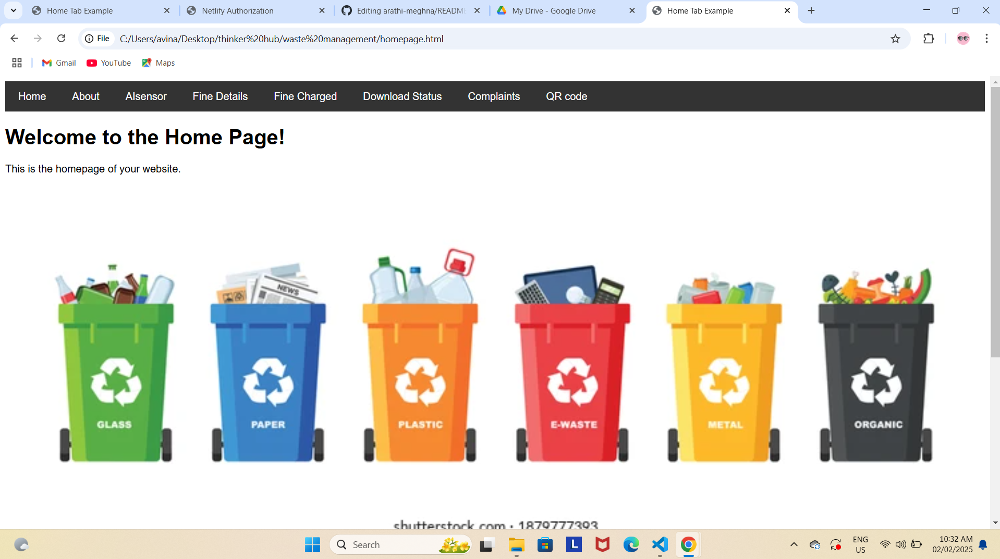
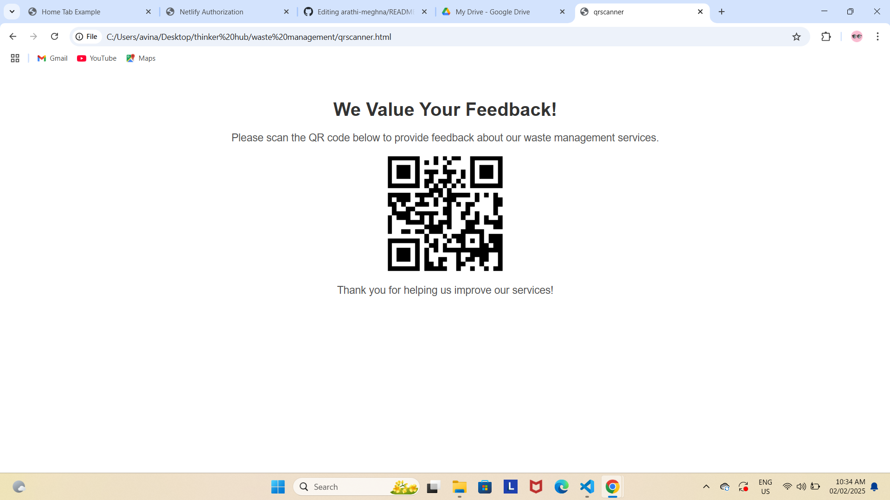

# [waste management] 🎯

## Basic Details
### Team Name: [Tech]

### Team Members
- Member 1: [Arathi Sathyan] - [College of Engineering,Adoor]
- Member 2: [Meghna Sudheer] - [College of Engineering,Adoor]
- Member 3: [Name] - [College]

### Hosted Project Link
legendary-crisp-3d2f95.netlify.app

### Project Description
waste management system

### The Problem statement
[deposition of garbages into public places ]

### The Solution
[AI sensor which detect the person who throws garbages into public places and send them fine according to the waste type]

## Technical Details
### Technologies/Components Used
For Software:
- [HTML ,css,javascript]
- 
-vscode

For Hardware:
- [List main components]
- [List specifications]
- [List tools required]

### Implementation
For Software:
# Installation
[commands]

# Run
[commands]

### Project Documentation
For Software:

# Screenshots (Add at least 3)

*contains image and video related to waste management*

**

*Add caption explaining what this shows*

# Diagrams

*Add caption explaining your workflow*

For Hardware:

# Schematic & Circuit

*Add caption explaining connections*

*Add caption explaining the schematic*

# Build Photos

*List out all components shown*

*Explain the build steps*

*Explain the final build*

### Project Demo
# Video
(https://drive.google.com/drive/folders/1iMrh2eEZ847Hs6jGUNWsFWRVl8s7tJtG?usp=sharing)
*Explain what the video demonstrates*

# Additional Demos
[Add any extra demo materials/links]

## Team Contributions
- meghna sudheer
- arathi sathyan

---
Made with ❤️ at TinkerHub
